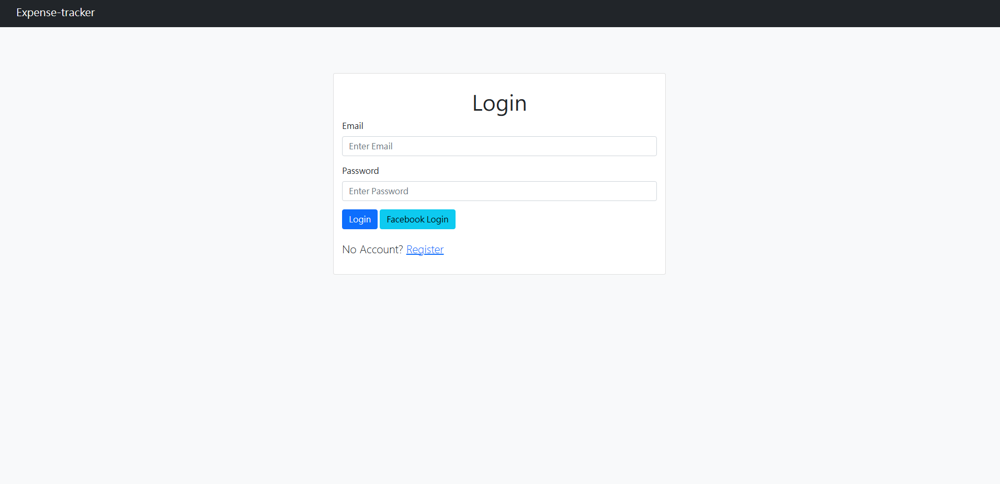
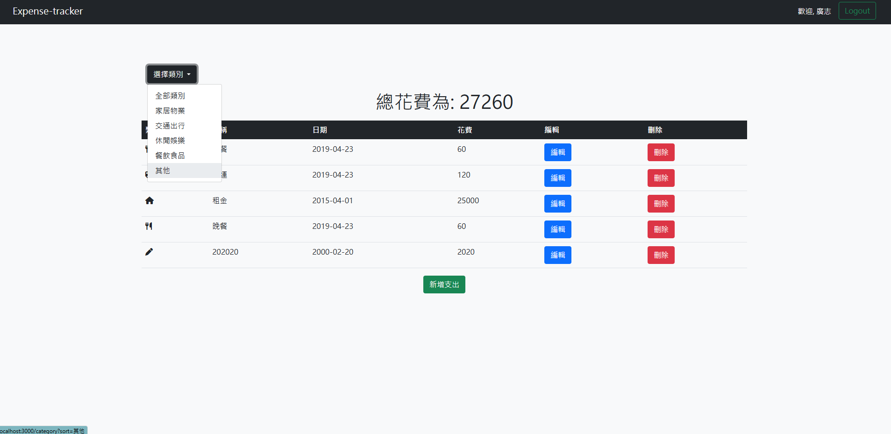
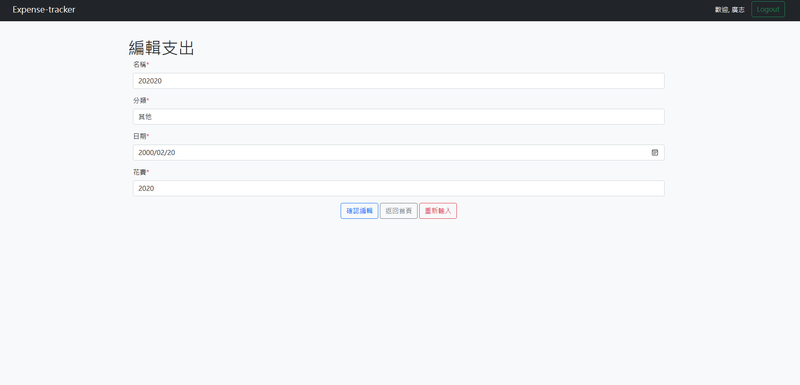

Expense-tracker
===========


*登入頁面示範*

*篩選功能示範*

*編輯頁面示範*

## 介紹

一款能夠紀錄管理自己支出紀錄的程式。

- [前往功能](#features)
- [前往更新](#updates)
- [前往開始使用](#start)
- [前往開發工具(環境)](#development-tools)

### 功能<a name="features"></a>

* 註冊、登入、登出功能
* 可使用facebook登入
* 可自行新增、修改、刪除項目
* 根據分類提供篩選功能
* 可依據不同分類計算總支出


### 更新<a name="updates"></a>

* 暫無更新

## 開始使用<a name="start"></a>

1. 請先確認已安裝 Node.js 與 npm ，輸入下方指令可以確認版本

   ```bash
   $ node -v
   $ npm -v
   ```

2. 接著將此專案 clone 至欲安裝之位置，或在欲安裝之位置開啟終端機輸入下列指令

   ```bash
   $ git clone https://github.com/w3i3538/expense-tracker
   ```

3. 確認安裝完成後，開啟本專案資料夾，並使用終端機


4. 透過npm安裝所有套件

   ```bash
   $ npm install
   ```

5. 安裝完畢後，請在本專案資料夾中，根據.env.example內容指示，建立一個.env檔案設置環境變數

   ```bash
   MONGODB_URI=設定你的MongoDB連線字串
   FACEBOOK_ID=設定你的Facebook App ID
   FACEBOOK_SECRET=設定你的Facebook App Secret
   FACEBOOK_CALLBACK=http://localhost:3000/auth/facebook/callback
   SESSION_SECRET=設定一串字串
   PORT=3000或其他數字，若更改上方也需一併更改
   ```

5. 設置.env完畢後，可以選擇是否建立種子資料

   ```bash
   $ npm run seed
   ```

6. 建立完畢後，若環境已安裝Nodemon可輸入第一段指令，若無則使用第二段，開啟伺服器

   ```bash
   $ npm run dev  
   $ npm run start
   ```

7. 若看見此行訊息則代表伺服器順利運行、mongoDB成功連接

   ```bash
   App is running on http://localhost:3000
   mongodb connected!
   ```

8. 開啟瀏覽器進入網站，即可正常使用

   ```bash
   http://localhost:3000
   ```

8. 若欲暫停使用伺服器，在終端機輸入

   ```bash
   $ ctrl + c
   ```

## 開發工具(環境)<a name="development-tools"></a>


- bcryptjs: 2.4.3
- body-parser: 1.20.2
- connect-flash: 0.1.1
- dayjs: 1.11.9
- dotenv: 16.3.1
- eslint: 8.47.0
- express: 4.18.2
- express-handlebars: 5.3.2
- express-session: 1.17.3
- method-override: 3.0.0
- mongoose: 7.4.0
- passport: 0.4.1
- passport-facebook: 3.0.0
- passport-local: 1.0.0

